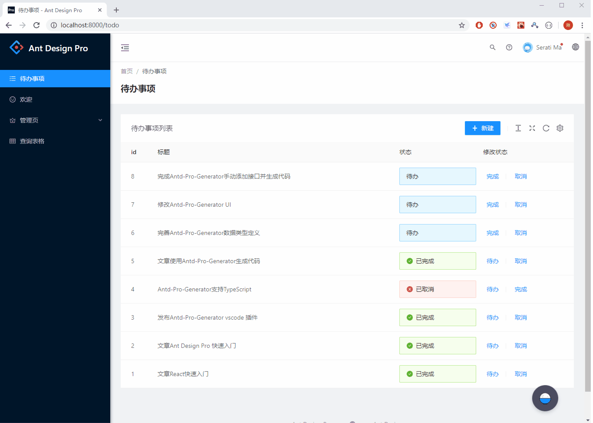

# todo-list

This is a demo for ant design pro 4.x

本项目是 ant design pro 4 一演示项目，我的文章[《Ant Design Pro 快速入门之二--Ant Design Pro 实战》](https://www.yuque.com/garrett/gmoupg/uk3zhz)的配套代码,请结合使用本代码。



# 代码使用方法

克隆代码

```bash
git clone https://github.com/garrett12138/todo-list.git
```

进入目录安装依赖、运行

```bash
cd todo-list
npm install
npm start
```

从第一步开始，每一步都建了 tag，可以依次 checkout 来看每一步代码的变化、对比。

比如第一步配置路由之后的代码

```bash
git chehckout step-1
```

step-1 到 step10 分别对应文中的大纲如下

step-1 配置路由 step-2 添加空白页面 step-3 修改国际化资源 step-4 修改空白页面 step-5 添加后端接口访问函数 step-6 添加 mock 代码 step-7 添加 model step-8 修改页面 step-9 修改 mock 逻辑 step-10 修改顶部头像下拉菜单
